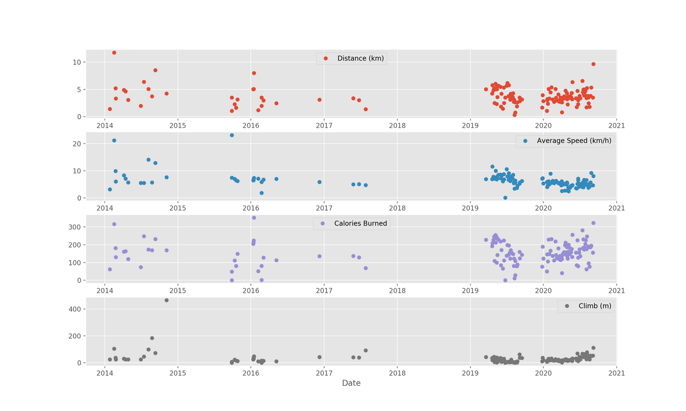

## My Data Science Journey

---

### Portfolio

[Project 1: Bike-Sharing Demand Prediction](https://github.com/lam771994/Bike-Sharing_Demand_Prediction)

Photo by Stéphane Mingot on Unsplash

---
[Project 2 Title](/pdf/sample_presentation.pdf)

---
[Project 3: Analysis of My Runkeeper Fitness Data](https://github.com/lam771994/Analysis-of-My-Runkeeper-Fitness-Data)

---

### List of Projects

- [Project 1: Analysis of My Runkeeper Fitness Data](https://github.com/lam771994/Analysis-of-My-Runkeeper-Fitness-Data)
- [Project 2 Title](http://example.com/)
- [Project 3 Title](http://example.com/)
- [Project 4 Title](http://example.com/)
- [Project 5 Title](http://example.com/)

---

### Publications

1. Analytics in Human Trafficking: A Review - 5th Global Conference on Computing and Media Technology (GCMT 2021)

---
